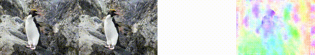
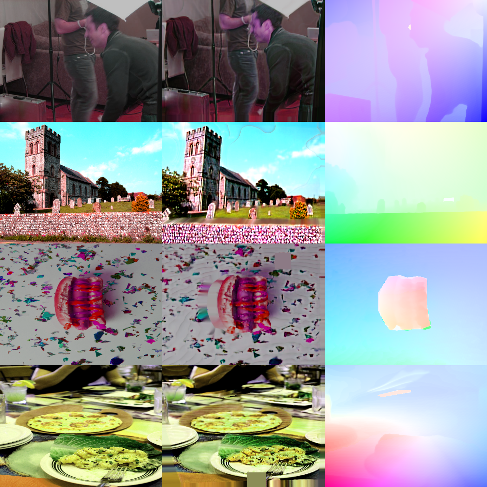

# [ICCV 2023] MPI-Flow: Learning Realistic Optical Flow with Multiplane Images
This repository contains the modified online training source code for our paper:

[Paper](https://arxiv.org/abs/2309.06714) | [Checkpoints](https://drive.google.com/drive/folders/1q0UxlswSwZjLgLkEjUNmBuVi0LJfY_b7?usp=sharing) | [Project Page](https://sites.google.com/view/mpi-flow) | [My Home Page](https://sites.google.com/view/yingpingliang/home)

Code repository is under construction... 🏗️ 🚧 🔨

## Update
- **2023.12.24:** Update [online trained checkpoints](https://github.com/Sharpiless/Train-RAFT-from-single-view-images/blob/main/checkpoints/32000_ours_general.pth).
- **2023.12.18:** Code for online training released (It's still being examined).
- **2023.09.13:** Code released.

## Performance
3.2w steps:
| Dataset   | EPE        | F1      |
| :-------: | :--------: | :-----: |
| KITTI-15 (train) | 3.537468 | 11.694042 |
| Sintel.C | 1.857986 | - |
| Sintel.F | 3.250774 | - |

From left to right:

1) original image; 2) generated image; 3) generated optical flow; 4) predicted by RAFT (C+T)



Generated training examples (after augmentation):



## Requirements

See also [https://github.com/Sharpiless/MPI-Flow](https://github.com/Sharpiless/MPI-Flow)

## Required Data

To train RAFT with MPI-Flow, you will only need to create a single folder contains: 

```Shell
├── datasets
    ├── custom
        ├── images
        ├── disps
        ├── masks
```

The "images" folder contains your custom single-view images (for example, COCO dataset).

The "disps" folder contains depths predicted by [MiDaS](https://github.com/isl-org/MiDaS).

The "masks" folder contains masks predicted by [Mask2Former](https://github.com/facebookresearch/Mask2Former).

To evaluate RAFT, you will need to download the required datasets. 
* [FlyingChairs](https://lmb.informatik.uni-freiburg.de/resources/datasets/FlyingChairs.en.html#flyingchairs)
* [FlyingThings3D](https://lmb.informatik.uni-freiburg.de/resources/datasets/SceneFlowDatasets.en.html)
* [Sintel](http://sintel.is.tue.mpg.de/)
* [KITTI](http://www.cvlibs.net/datasets/kitti/eval_scene_flow.php?benchmark=flow)
* [HD1K](http://hci-benchmark.iwr.uni-heidelberg.de/) (optional)


By default `datasets.py` will search for the datasets in these locations. You can create symbolic links to wherever the datasets were downloaded in the `datasets` folder

```Shell
├── datasets
    ├── Sintel
        ├── test
        ├── training
    ├── KITTI
        ├── testing
        ├── training
        ├── devkit
    ├── FlyingChairs_release
        ├── data
    ├── FlyingThings3D
        ├── frames_cleanpass
        ├── frames_finalpass
        ├── optical_flow
```

## Evaluation
You can evaluate a trained model using `evaluate.py`
```Shell
python evaluate.py --model=models/raft-things.pth --dataset=sintel --mixed_precision
```

## Training
We used the following training schedule in our paper. Training logs will be written to the `runs` which can be visualized using tensorboard
```Shell
./train.sh
```

## Checkpoints

Checkpoints to reproduce our results in Table 1 can be downloaded in [Google Drive](https://drive.google.com/drive/folders/1q0UxlswSwZjLgLkEjUNmBuVi0LJfY_b7?usp=sharing).

You can use the code in [RAFT](https://github.com/princeton-vl/RAFT) to evaluate/train the models.

## Contact
If you have any questions, please contact Yingping Liang (liangyingping@bit.edu.cn).

## License and Citation
This repository can only be used for personal/research/non-commercial purposes.
Please cite the following paper if this model helps your research:

    @inproceedings{liang2023mpi,
        author = {Liang, Yingping and Liu, Jiaming and Zhang, Debing and Ying, Fu},
        title = {MPI-Flow: Learning Realistic Optical Flow with Multiplane Images},
        booktitle = {In the IEEE International Conference on Computer Vision (ICCV)},
        year={2023}
    }
